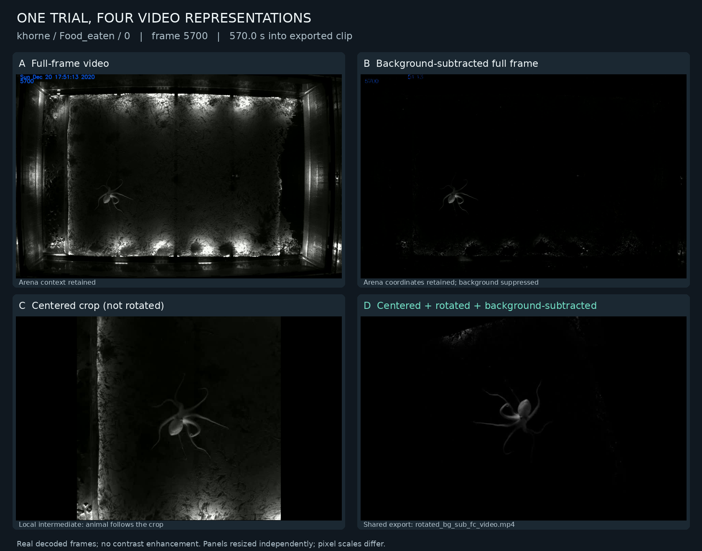
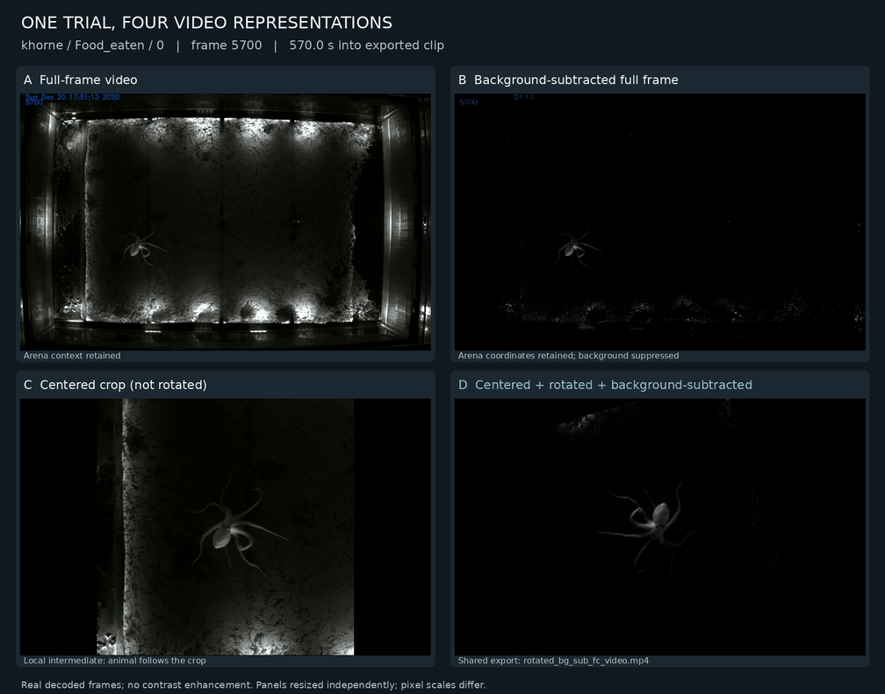

# Working with the 1T octopus-centered, rotated videos

*Written by gpt-6-astra (via Hermes Agent), at Willem Weertman's request. The examples below are extracted from real recordings, not AI-generated imagery.*

This guide is for collaborators who want to work with **videos from the single-target (1T) experiment**, especially in an octopus-centered reference frame. Start with the **existing processed MP4s**; you do not need to train or run DeepLabCut, download all the full-frame recordings, or rerun the paper's notebooks just to use them.

## Visual examples: what the representations look like

All four panels show the **same trial, `khorne / Food_eaten / 0`, at frame 5700 (570.0 s into the exported clip)**. This is a selected illustrative moment, not a summary of the whole dataset.



| Panel | What you see | What it is useful for |
| --- | --- | --- |
| **A — Full frame** | The animal in the arena, including walls and lighting/background structure | Arena-relative position, movement, and checking the original visual context |
| **B — Background-subtracted full frame** | The same frame with background suppressed; animal position stays in arena coordinates | Seeing the foreground while preserving spatial context; residual background is still visible |
| **C — Centered, not rotated** | A local 600 × 600 tracking crop; the animal stays near the center but orientation changes | Understanding the difference between centering and body-axis alignment. This is a **local intermediate**, not a file promised in the shared trial folder |
| **D — Centered, rotated, background-subtracted** | The shared `rotated_bg_sub_fc_video.mp4` export | The recommended starting point for body-centered posture/appearance analysis |

Panels are resized independently to fit the figure: **their displayed pixel scales are not equal**. No contrast enhancement was applied. The dim animal, residual background, crop boundaries, and rotation padding are real properties of the videos, not binary masks. Centering and rotation depend on tracking and do not eliminate all jitter or tracking errors.

### The same representations in motion

The loop below shows a six-second interval starting at 570.0 s, displaying every other source frame at 5 fps for real-time playback. It is a reduced-size GIF preview, not an analysis input; use the original MP4s for measurements. The image above provides a larger still for inspection.



**Source/provenance:** A and C were extracted from the local archive's matching `khorne__2020_12_2020__17_41_26_100__0__6000.mp4` and `fc__khorne__2020_12_2020__17_41_26_100__0__6000.mp4`. B and D were extracted from the shared trial's `background_sub_ff_video.mp4` and `rotated_bg_sub_fc_video.mp4`. All four report 10 fps; A/B/C have 6,000 frames and D has 5,999. The sampled frames were visually checked for corresponding posture. This example does not establish alignment for other trials. [Source checksums and frame indices](assets/1T-video-examples/provenance.json) and the [rendering script](scripts/render_video_examples.py) are included for reproducibility. To rerender, install `opencv-python-headless` and `Pillow`, then run the script with `--help` to see the four input-file arguments, output directory, frame index, and TrueType font path. It writes documentation assets only; it does not regenerate the tracking or processed videos.

## 1. Download the right files

Open the [shared trajectories folder on Dropbox](https://www.dropbox.com/scl/fo/m2efo9lybu48gpjqfbo8e/APp2MDWyOpfX3CW15w5maho?rlkey=msy8iuzk9qmtxxomfy89c93gw&st=m1l56jy7&dl=0).

Navigate through **animal → condition → trial folder** and download:

**`rotated_bg_sub_fc_video.mp4`**

This is the background-subtracted, octopus-centered, rotated video. Start with one trial, confirm it opens locally, and only then download more. Use Dropbox's **Download** action rather than saving the preview web page. A folder download may arrive as a ZIP; extract it before opening the videos. If a large folder download fails, download smaller condition/trial folders or individual files. The shared folder was browsable without signing in during the check below; if access changes, contact the repository owner.

The shared trajectories folder contains the animals `khorne`, `korra`, `kratos`, `larsson`, and `ninja`. Condition folders use these exact spellings:

- `Food_eaten`
- `Food_not_eaten`
- `No_food_Control` — preserve the capital `C`, particularly on Linux.

### A concrete first trial

Open [khorne / Food_eaten / 0](https://www.dropbox.com/scl/fo/m2efo9lybu48gpjqfbo8e/ABCXbBv7f4h2KQ0IHINahTM/khorne/Food_eaten/0?rlkey=msy8iuzk9qmtxxomfy89c93gw&dl=0) and download `rotated_bg_sub_fc_video.mp4` (approximately 13 MB).

On Linux/macOS, this equivalent command downloads that specific file. Run it in your chosen data directory; it does not download the whole dataset:

```bash
mkdir -p trajectories/khorne/Food_eaten/0
curl --fail --location --retry 3 \
  'https://www.dropbox.com/scl/fo/m2efo9lybu48gpjqfbo8e/AOtBDnIyfelG06CdyDGmyhE/khorne/Food_eaten/0/rotated_bg_sub_fc_video.mp4?rlkey=msy8iuzk9qmtxxomfy89c93gw&dl=1' \
  --output trajectories/khorne/Food_eaten/0/rotated_bg_sub_fc_video.mp4
```

The quotes around the URL matter: it contains `&`. This command overwrites that destination if it already exists, so do not use it on a modified working copy. On Windows, the browser download is the simplest option.

### Keep trial identities intact

Every trial's rotated video has the **same filename**. Do not put all downloads into one flat directory: they will collide or acquire ambiguous suffixes. Preserve the hierarchy, for example:

```text
my-octopus-data/
└── trajectories/
    ├── khorne/
    │   └── Food_eaten/
    │       └── 0/
    │           └── rotated_bg_sub_fc_video.mp4
    └── ...
```

Treat `(animal, condition, trial folder)` as the identifier, not the MP4 basename or trial number alone. Keep downloaded originals unchanged and put derived clips, annotations, and transcodes somewhere separate. Keep the full-frame filename and small metadata files if downloading whole trial folders.

### Which other files do I need?

| File | Purpose | Needed just to use rotated videos? |
| --- | --- | --- |
| `rotated_bg_sub_fc_video.mp4` | Centered, rotated, background-subtracted view | **Yes: start here** |
| `background_sub_ff_video.mp4` | Background-subtracted view in full-frame coordinates | No; useful for checking processing/alignment |
| `*_ff.mp4` | Full-frame trial video, retaining arena context | No; useful for interpreting movements and artifacts |
| `*.h5` | DeepLabCut tracking output | No; useful for reprocessing or checking eye positions |
| `1t_trajectories_data.pickle` | Processed analysis table at the trajectories-folder root | No; only for joining to the paper's analysis |
| `rotated_bg_fc_video_drawn_frames.mp4`, `area_calculation_diagostic_video.mp4`, `shell_trace.png` | Diagnostic/analysis products | No; not substitutes for the clean rotated MP4 |

The example trial contains these video/diagnostic products; contents may differ across trials. The [broader 1T share](https://www.dropbox.com/scl/fo/3vc6q20s6bihbi2tuc63s/APeF3aU7wNxdf148oroggIU?rlkey=uf66439yaeohm57virb9j4rf5&st=ldlo9gjk&dl=0) is also linked from this repository, but use the **trajectories share above** for this workflow. Cloning GitHub alone does **not** download the external trajectory videos. The short FAAM clips in `DATA/1T/fast_arm_aligned_motions/videos/` are selected behavioral excerpts, not the complete collection of rotated trial videos.

## 2. Understand the view before analyzing it

The generation code is in [`CODE/1T/1t-approaches.ipynb`](../CODE/1T/1t-approaches.ipynb), in the cells defining `given_xy_xy_get_bodyaxis_angle`, `given_a_xy_crop_img`, and `rotate_image`.

- **Center:** midpoint between the tracked left and right eyes, not the silhouette centroid.
- **Rotation:** based on the eye-derived body axis, not travel direction and not alignment to an individual arm. In image coordinates, the code computes `bodyaxis_angle = atan2(rey - ley, rex - lex) - pi/2`, then passes `degrees(bodyaxis_angle) - 90` to OpenCV's rotation function. Do not assume a different head-up convention when combining these videos with another dataset.
- **Processing:** the notebook cleans/smooths eye tracks before centering and rotation (including a 29-frame, degree-5 Savitzky–Golay filter). These are processed views, not untouched camera recordings.
- **Output:** the writer requests **600 × 600 pixels at 10 fps**, grayscale content encoded in an MP4. Read each file's actual metadata rather than assuming all downloads match.
- **Borders/background:** cropping and rotation introduce black padding. Background subtraction can leave residual structures and remove faint animal details. These are not segmentation masks or guaranteed clean silhouettes.
- **Timing:** use zero-based frame indices and the file's measured fps for time within the exported clip. Do not equate clip time zero with the start of the original experiment without checking its metadata.
- **Frame count:** the notebook stores several tracking arrays with `[:-1]` after computing frame differences, and the rotated writer iterates over those arrays. Consequently a rotated video can be one frame shorter than its source. Check counts and offsets before joining tracking or labels; do not silently truncate mismatched data.

The crop stabilizes position and orientation, so it removes the arena-relative translation/rotation you would need to infer swimming/crawling trajectories or orientation relative to flow. Keep the matching full-frame video/tracks for those questions. Inspect trials for tracking slips, abrupt rotation, clipping of arms, poor contrast, and background artifacts before annotating or measuring them. The notebook's `inBox` flag controls inclusion in its aggregate images, **not** whether a frame is written to the rotated MP4; exported videos are not automatically restricted to valid in-arena moments.

## 3. Open and verify one video

First open the downloaded MP4 in a local player such as VLC. Scrub through the start, middle, and end. A failed Dropbox browser preview does not by itself mean the downloaded file is broken.

If FFmpeg is installed, inspect the metadata and decode the whole file to check for errors:

```bash
ffprobe -v error -select_streams v:0 \
  -show_entries stream=codec_name,width,height,r_frame_rate,nb_frames,duration \
  -of json trajectories/khorne/Food_eaten/0/rotated_bg_sub_fc_video.mp4

ffmpeg -v error \
  -i trajectories/khorne/Food_eaten/0/rotated_bg_sub_fc_video.mp4 \
  -f null -
```

For the example file checked on **2026-09-17**, FFprobe reported MPEG-4 video, 600 × 600 pixels, 10 fps, **5,999 frames**, and **599.9 seconds**. Full-file decoding completed without reported errors. These are example-file results, not an audit of every trial or a total dataset size.

## 4. Read frames in Python without loading a whole video into RAM

Python is optional for viewing. For analysis, create a dedicated environment; no GPU or DeepLabCut installation is needed for reading these existing MP4s:

```bash
python3 -m venv .venv
source .venv/bin/activate
python -m pip install opencv-python-headless
```

On Windows, use `py -m venv .venv` and activate with `.venv\Scripts\Activate.ps1` in PowerShell (or `.venv\Scripts\activate.bat` in Command Prompt). The headless OpenCV package supports video reading and image writing but not `cv2.imshow`; view saved images with your usual image viewer. Record your installed versions with `python -m pip freeze > environment-used.txt`.

Save the following as `inspect_rotated.py` in `my-octopus-data/`, then run `python inspect_rotated.py`. It scans only the target rotated videos, reads frames sequentially, writes a trial manifest, and saves one representative frame per trial. It leaves the MP4s unchanged. Run it on your one-trial download first; scanning a full collection decodes every frame and takes longer.

```python
from pathlib import Path
import csv
import math
import cv2

root = Path("trajectories")
files = sorted(root.glob("*/*/*/rotated_bg_sub_fc_video.mp4"))
if not files:
    raise SystemExit("No rotated videos found: check root and ZIP extraction layout.")

out = Path("inspection")
out.mkdir(exist_ok=True)
with (out / "video_manifest.csv").open("w", newline="", encoding="utf-8") as f:
    writer = csv.writer(f)
    writer.writerow([
        "animal", "condition", "trial", "relative_path", "fps", "width",
        "height", "reported_frames", "decoded_frames", "decoded_seconds", "status"
    ])
    for path in files:
        animal, condition, trial, _ = path.relative_to(root).parts
        cap = cv2.VideoCapture(str(path))
        try:
            if not cap.isOpened():
                raise RuntimeError(f"Cannot open {path}")
            fps = cap.get(cv2.CAP_PROP_FPS)
            width = int(cap.get(cv2.CAP_PROP_FRAME_WIDTH))
            height = int(cap.get(cv2.CAP_PROP_FRAME_HEIGHT))
            reported = int(cap.get(cv2.CAP_PROP_FRAME_COUNT))
            if not math.isfinite(fps) or fps <= 0:
                raise RuntimeError(f"Invalid fps for {path}: {fps}")
            decoded = 0
            while True:
                ok, frame = cap.read()
                if not ok:
                    break
                # OpenCV decodes to BGR; convert if your analysis wants grayscale.
                gray = cv2.cvtColor(frame, cv2.COLOR_BGR2GRAY)
                if decoded == reported // 2:
                    preview = out / animal / condition / trial / "middle.png"
                    preview.parent.mkdir(parents=True, exist_ok=True)
                    if not cv2.imwrite(str(preview), gray):
                        raise RuntimeError(f"Cannot write {preview}")
                # Add per-frame analysis here. Time within this clip = decoded / fps.
                decoded += 1
            status = "OK" if decoded == reported and decoded > 0 else "CHECK_FRAME_COUNT"
            writer.writerow([
                animal, condition, trial, path.relative_to(root).as_posix(),
                fps, width, height, reported, decoded, decoded / fps, status
            ])
            print(path, decoded, "frames", status)
        finally:
            cap.release()
```

Inspect `inspection/video_manifest.csv` and the saved images. `OK` means the reported and decoded frame counts agree; it does **not** certify tracking quality or temporal alignment. An early decoder failure can look like end-of-file in OpenCV, so investigate any mismatch with FFmpeg and try downloading the file again. Re-running the script replaces the manifest and matching preview images.

## 5. Optional compatibility copies

If your annotation tool/browser cannot read the original MPEG-4 codec, make a separate H.264 copy with FFmpeg:

```bash
mkdir -p working/khorne/Food_eaten/0
ffmpeg -n -i trajectories/khorne/Food_eaten/0/rotated_bg_sub_fc_video.mp4 \
  -map 0:v:0 -an -c:v libx264 -crf 18 -pix_fmt yuv420p -movflags +faststart \
  working/khorne/Food_eaten/0/rotated_h264.mp4
```

`-n` refuses to overwrite an existing output. This is a **lossy compatibility copy**, not a replacement for the downloaded original. No new frame rate, resizing, or trimming is requested; still verify fps/frame count afterward. Keep annotations keyed to the original trial and zero-based frame number, and record any subsequent trimming/resampling offsets. Avoid exporting the whole collection to PNG unless your tool requires it: it can greatly increase disk use.

## 6. If you need tracking data or want to regenerate the videos

For simply using the existing rotated MP4s, **stop here**: you have workable videos and trial identifiers.

For deeper analysis, keep the matching `.h5`, trial metadata, and full-frame files. The optional `1t_trajectories_data.pickle` is a pandas analysis table, not a video archive. Load pickle/HDF files only from trusted sources; pickle loading can execute code. Older serialized pandas objects may need a compatible environment, and stored `subdir` paths may refer to the author's computer and need explicit remapping to your local root.

The notebooks are research workflows, not a one-click installer. If you need to regenerate or change the crop/background/rotation:

1. Work on a **copy** of one complete trial first; do not overwrite the shared exports.
2. Inspect `CODE/1T/1t-approaches.ipynb`. Its `data_root` is `../../DATA/1T/trajectories`, relative to the notebook working directory. Either reproduce that layout or change the path explicitly. Set `animals` and `experiments` to your downloaded subset.
3. Review the tracking columns rather than picking an arbitrary `.h5`: the notebook selects eye coordinates by column position, with different positions for `Food_eaten` versus the other conditions. Verify those columns and the correspondence of tracking rows to video frames before processing.
4. The rotation cell reads `background_sub_ff_video.mp4` and writes `rotated_bg_sub_fc_video.mp4`. It is guarded by per-animal `mean_frames_<animal>.png` / `std_frames_<animal>.png` cache checks and `rerun`; existing cached images can skip generation even when a trial output is missing. Conversely, forcing a rerun can overwrite existing rotated outputs.
5. `Create_food_eaten_bg_sub_videos.ipynb` contains the food-eaten background-subtraction workflow; it is not a general recipe for every condition. Review its paths and assumptions before use.
6. The original generation cells accumulate videos/frames in memory and can require substantial RAM. Do not “Run All” over the full dataset as an initial setup step. Scope to one trial, validate results against the existing export, then plan batch processing.

Changing the rotation convention, smoothing, background subtraction, or frame selection creates a new derivative dataset. Record those changes and preserve the source-to-output frame mapping so collaborators can compare results.

## Validation scope

This guide was checked against the repository's generation code and the live Dropbox trajectories layout. The single example `khorne/Food_eaten/0/rotated_bg_sub_fc_video.mp4` was downloaded, fully decoded with FFmpeg and the Python example, and visually sampled. The whole collection and notebook regeneration were **not** rerun or audited.

## 7. Work with the whole video set as one analysis dataset

*Written by gpt-6-astra (via Hermes Agent), at Willem Weertman's request.*

**Treat the collection as one indexed dataset, not one giant video or an array of every frame in RAM.** Keep the individual MP4s and run the same analysis over each trial. This preserves trial boundaries and makes interrupted work easier to resume.

### Download and inventory the collection

1. Use the **trajectories Dropbox share in section 1**. Download all animal folders, or download them in condition/trial batches if a whole-folder ZIP fails. Whole folders include other products, so they require more storage than the rotated MP4s alone. If downloading just the rotated files, keep the same animal/condition/trial hierarchy. Do not include `shells` as an animal or mix diagnostic MP4s into the input set.
2. Extract/merge each batch under a single local `trajectories/` directory. Check for accidental extra nesting such as `trajectories/trajectories/` and do not flatten the folders. Keep originals on disk; use a separate directory for analysis results.
3. Run `inspect_rotated.py` from section 4 against that root. **It already processes every matching trial**, not only the example. Its manifest is the starting index for the whole dataset; resolve `CHECK_FRAME_COUNT` entries before analysis.
4. Compare local animal/condition/trial folders with the Dropbox folders you intended to download. The manifest lists **files present locally**, not files missing from the share. A successful scan does not prove the download is complete. Record which batches were downloaded and any missing or excluded trials.

### Make a dataset-level coverage table

In the same activated environment, install pandas with `python -m pip install pandas`. Save this as `summarize_dataset.py` alongside `inspect_rotated.py` and run `python summarize_dataset.py`:

```python
from pathlib import Path
import pandas as pd

manifest = Path("inspection/video_manifest.csv")
videos = pd.read_csv(manifest, dtype={
    "animal": str, "condition": str, "trial": str, "relative_path": str
})
keys = ["animal", "condition", "trial"]
if videos.empty or videos.duplicated(keys).any():
    raise ValueError("Empty manifest or duplicate trial identities: inspect the inputs.")
if not videos["status"].eq("OK").all():
    raise ValueError("Resolve flagged videos before using this manifest for analysis.")

coverage = videos.groupby(["animal", "condition"], as_index=False).agg(
    trials=("trial", "size"),
    frames=("decoded_frames", "sum"),
    seconds=("decoded_seconds", "sum"),
)
coverage.to_csv(manifest.parent / "coverage_by_animal_condition.csv", index=False)
print(coverage.to_string(index=False))
print(f"Inventoried {len(videos)} local trials across {videos['animal'].nunique()} animals.")
```

This summarizes **coverage**, not behavior. Absent animal/condition combinations are absent rows, not evidence of zero behavior. Check the table for unexpected gaps, unequal recording durations, and conditions represented by only a subset of animals. The script replaces its coverage CSV when rerun.

### Apply your analysis to every trial, then combine the outputs

Use the per-frame loop in `inspect_rotated.py` as the starting point: replace its `Add per-frame analysis here` comment with your feature extraction, model inference, or annotation lookup. For a production analysis, keep this separate from the inspection script and use the reviewed manifest to select inputs.

- **Process sequentially or in bounded batches.** Decode one video at a time and write results as you go. For a GPU model, collect only a small batch of frames, run inference, write the predictions, then discard that batch. Do not build a list of all decoded videos. Start with one worker; add parallel video workers only after checking RAM, disk throughput, and GPU memory.
- **Give every result a stable key:** `animal`, `condition`, `trial`, and zero-based `frame_index`. Also retain `relative_path`, measured `fps`, and `time_s = frame_index / fps`. For example, a per-frame output might have columns `animal,condition,trial,frame_index,time_s,feature_value,qc_flag`. Frames sampled every N steps still keep their **original** frame indices, not a new consecutive numbering.
- **Save one result file per trial**, for example `analysis/run_01/khorne/Food_eaten/0/features.csv`. Use a new run directory when changing the model or parameters. Save the input manifest, environment versions, code version, model identifier, and analysis settings with the run. Write to a temporary filename and rename it only when the trial finishes; skip completed outputs on restart only if their source and analysis settings still match. Record failures separately rather than silently treating them as completed trials.
- **Combine tables, not MP4s.** Concatenate the per-trial feature tables for plotting or statistics, keeping all identity columns. For large frame-level tables, use partitioned Parquet or a database rather than one ever-growing in-memory dataframe. Often it is enough to compute one summary row per trial first, then combine those much smaller tables. Reset temporal models, frame differences, and rolling windows at every trial boundary.
- **Use appropriate experimental units.** Frames within a trial and trials from the same animal are not independent animals. For condition comparisons, retain animal identity and use animal-level summaries or an appropriate repeated-measures/hierarchical analysis. Pooling all frames directly gives longer videos and animals with more trials more weight. Report included animals/trials, analyzed duration, and exclusions, not only a frame count.
- **Keep coordinate systems straight.** These videos are suitable for body-centered appearance/posture analyses. Arena-relative movement, heading versus flow, and plume position require the corresponding full-frame videos/tracking. Never join those data to the rotated videos solely by row number without checking the offsets and frame-count caveats in section 2.

A practical first pass is: **download all intended trials → inventory and inspect → run the analysis on one trial → batch the same analysis across the reviewed manifest → combine trial summaries → compare conditions while retaining animal identity**. The coverage code above was tested on the downloaded example; it is not a claim that every shared trial has been downloaded or analyzed.
